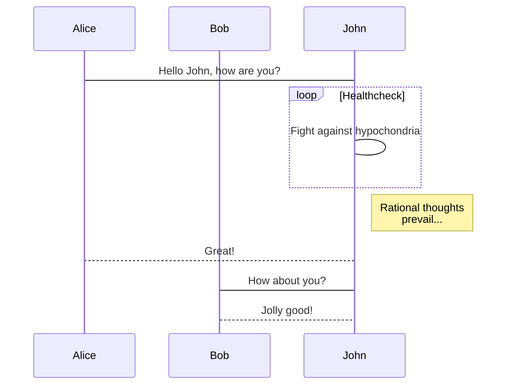
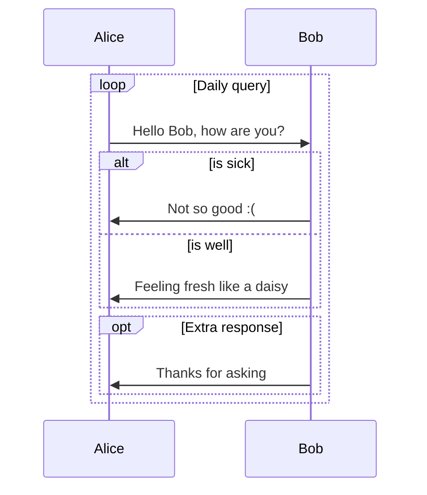
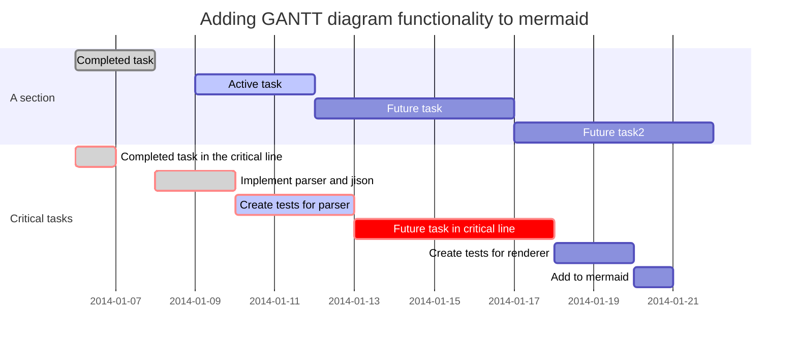
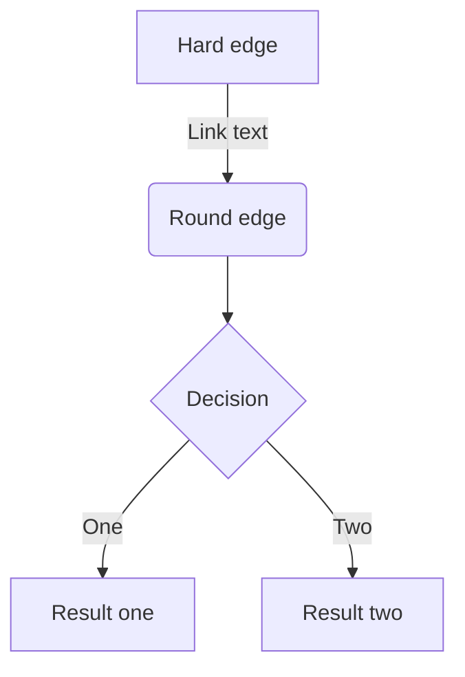
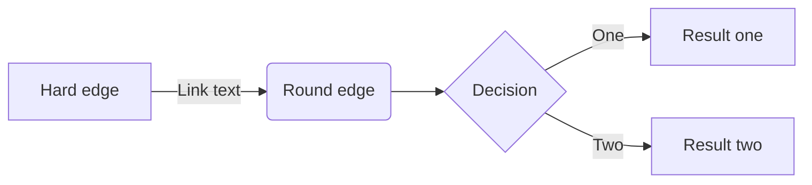
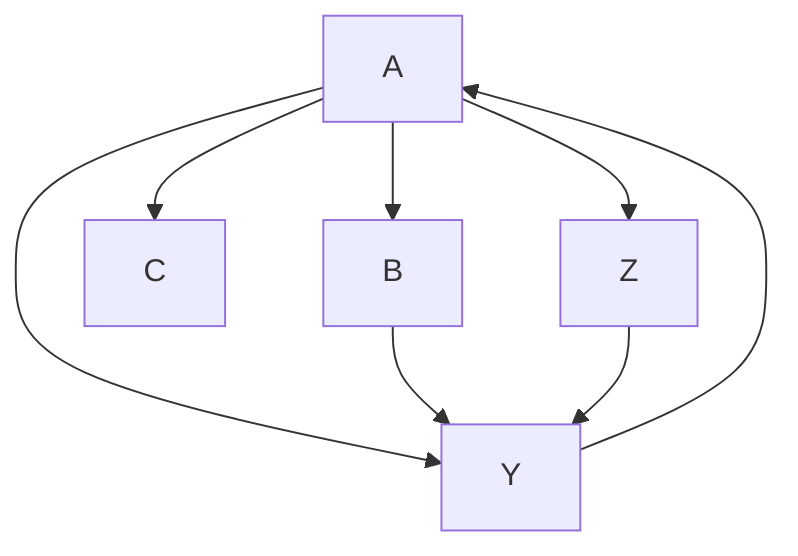

# Mermaid Diagram Examples

## Sequence Diagram

[Syntax Reference](https://mermaidjs.github.io/sequenceDiagram.html)

> [NOTE]
> Best viewed with Markdown Preview Extension's Forest theme

## Gantt Chart

[Syntax Reference](https://mermaidjs.github.io/gantt.html)

## Flowchart

[Syntax Reference](https://mermaidjs.github.io/flowchart.html)

